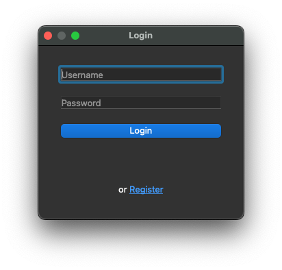
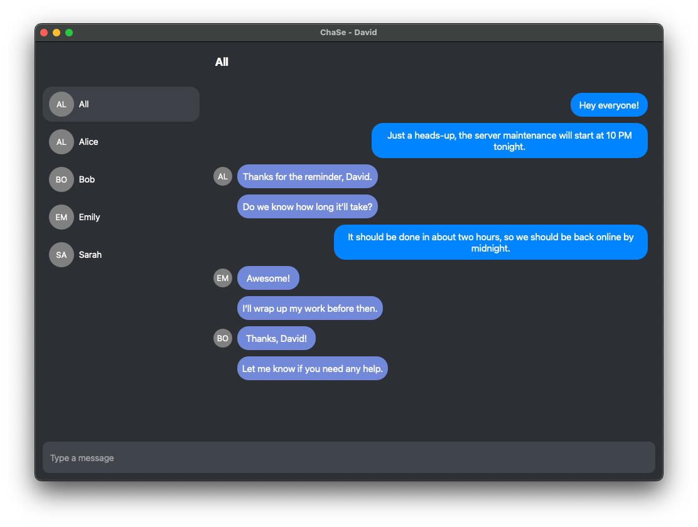
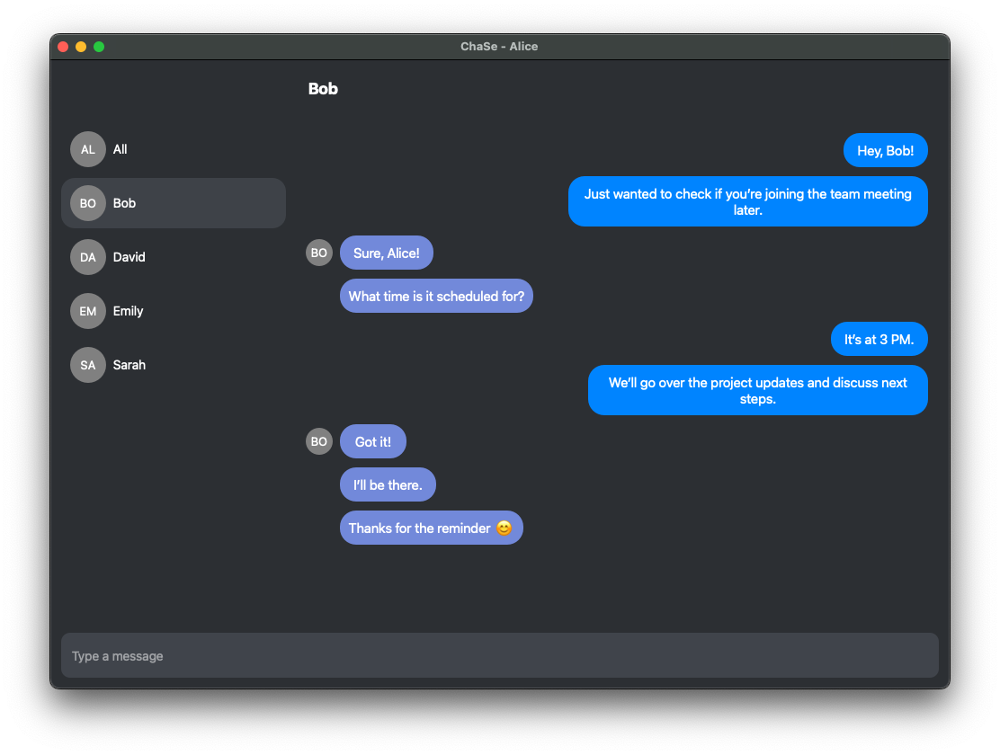

<h1 align="center">ChaSe</h1>


This application supports both public and private messaging, while allows users to register, log in, and communicate in real time using a client-server architecture.


<p align="center">
  
</p>


## Table of Contents

- [Features](#features)
- [Architecture](#architecture)
- [Technologies Used](#technologies-used)
- [Setup Instructions](#setup-instructions)
- [Certificates](#certificates)
- [Usage](#usage)
- [Future Improvements](#future-improvements)


## Features

- **User Registration and Login**: Users can create accounts, log in, and maintain session states. Passwords are securely hashed and salted using bcrypt, before sorting them in the database.
- **Public Messaging**: Messages sent in the public chat are visible to all connected users.
- **Private Messaging**: Direct messages between users, not visible to other users.
- **Message History**: Users can access their chat history upon login.
- **Notification System**: The client plays notification sounds when new messages are received.
- **SSL Encryption**: Data exchanged between the client and server is encrypted using SSL.


  

## Architecture

- **Client**: The client application is built using PyQt5 for the GUI and connects to the server using a secure SSL socket. It maintains both public and private chat sessions and handles message history retrieval.
- **Server**: The server handles multiple clients concurrently, managing user sessions, message broadcasting, and database interactions. It stores messages in a MySQL database and ensures secure communication with the client.
- **Database**: The MySQL database stores user credentials, login states, and message histories.

## Technologies Used

- **Python**: Core language for both client and server.
- **PyQt5**: GUI framework used for building the client interface.
- **MySQL**: Relational database for storing user information and messages.
- **SSL**: Secure communication between client and server.
- **bcrypt**: Password hashing for user credentials.


## Setup Instructions

1. **Clone the repository**:

```sh
git clone https://github.com/yourusername/chat-app.git
cd chat-app
```

2. **Set up the virtual environment**

```sh
python -m venv venv
source venv/bin/activate  # On Windows: venv\Scripts\activate
```

3. **Install dependencies**

```sh
pip install -r requirements.txt
```

4. **Database Setup**

```sh
CREATE TABLE `users` (
`id` int NOT NULL AUTO_INCREMENT,
`username` varchar(255) NOT NULL,
`password` varchar(255) NOT NULL,
`is_logged_in` tinyint(1) DEFAULT '0',
`username_lowercase` varchar(255) GENERATED ALWAYS AS (lower(`username`)) STORED,
PRIMARY KEY (`id`),
UNIQUE KEY `username` (`username`)
)

CREATE TABLE `messages` (
`id` int NOT NULL AUTO_INCREMENT,
`sender_id` int DEFAULT NULL,
`recipient_id` int DEFAULT NULL,
`group_id` int DEFAULT NULL,
`message` text NOT NULL,
`timestamp` timestamp NULL DEFAULT CURRENT_TIMESTAMP,
PRIMARY KEY (`id`),
KEY `sender_id` (`sender_id`),
KEY `recipient_id` (`recipient_id`),
KEY `group_id` (`group_id`),
CONSTRAINT `messages_ibfk_1` FOREIGN KEY (`sender_id`) REFERENCES `users` (`id`) ON DELETE CASCADE,
CONSTRAINT `messages_ibfk_2` FOREIGN KEY (`recipient_id`) REFERENCES `users` (`id`) ON DELETE CASCADE,
CONSTRAINT `messages_ibfk_3` FOREIGN KEY (`group_id`) REFERENCES `groups` (`id`) ON DELETE CASCADE
)
```

5. **Run the server**

```sh
python -m server.server
```

6. **Run the client**

```sh
python -m client.client
```

## Certificates

This project requires SSL certificates (cert.pem, key.pem, and optionally openssl.cnf) to establish secure communication between the client and server.

1. **For Local Development (Self-Signed Certificates)**

For local development or testing purposes, you can generate self-signed certificates using OpenSSL.

- Navigate to the certificates/ folder (or create it if it doesn't exist).

```sh
mkdir -p certificates
cd certificates
```

- Generate a self-signed certificate and private key - During this process, you'll be prompted to provide information such as the country name, state, locality, organization, and common name (domain).
If asked for a password, you can skip by pressing Enter or set one if needed.

```sh
openssl req -x509 -newkey rsa:4096 -keyout key.pem -out cert.pem -days 365
```

- Create an OpenSSL configuration file (openssl.cnf).

2. **For Production (Certificate Authority)**

In a production environment, you should use certificates from a trusted Certificate Authority (CA) such as Let's Encrypt (is just an example).

- Install Certbot (the Let's Encrypt client), on a Linux server:

```sh
sudo apt install certbot
```

- Run the following Certbot command to generate certificates for your domain:

```sh
sudo certbot certonly --standalone -d yourdomain.com
```
- Store the certificates securely.

3. **Configure SSL in the Application**

Make sure your code is set to load the certificates from the correct path. In the server-side connection setup (in server.py), you should load the certificates dynamically using relative paths. As it stands:

```sh
cert_file = os.path.join('certificates', 'cert.pem')
key_file = os.path.join('certificates', 'key.pem')
```

## Usage

- **Login/Register**: When the application starts, users are prompted to log in or register a new account. Upon successful login, users are taken to the main chat window.
- **Public Chat**: By default, users can send messages in a public chat room visible to all connected users.
- **Private Chat**: To start a private conversation, select a user from the sidebar and type your message. The messages exchanged in private chat are visible only to the involved users.
- **Message Notifications**: The client application will play a notification sound when new messages are received.
- **Message History**: Users can access the history of both public and private chats. Message history is automatically loaded when a user selects a chat.



### Key Interactions

- **Sending Messages**: Type your message in the input field and press "Enter" to send.
- **Switching Chats**: The sidebar lists all available users. Selecting a user switches the view to a private chat with that person. For public chat, select "All" from the sidebar.
- **Reconnecting**: If the connection is lost, the client attempts to reconnect automatically. If it fails, a message will be displayed, and the application will continue retrying for a limited number of attempts.


## Future Improvements

- **End-to-End Encryption (E2EE)**: End-to-End Encryption is a planned feature to ensure the privacy and security of private messages. Although an attempt to implement E2EE was made, it led to some unresolved issues, and the feature was temporarily postponed. The application currently uses SSL to secure the connection between client and server, but E2EE will be added in future when is fully tested and stable.
- **Group Chat**: Currently, group chat functionality is under consideration but not implemented, mostly because there is already a public chat available.
